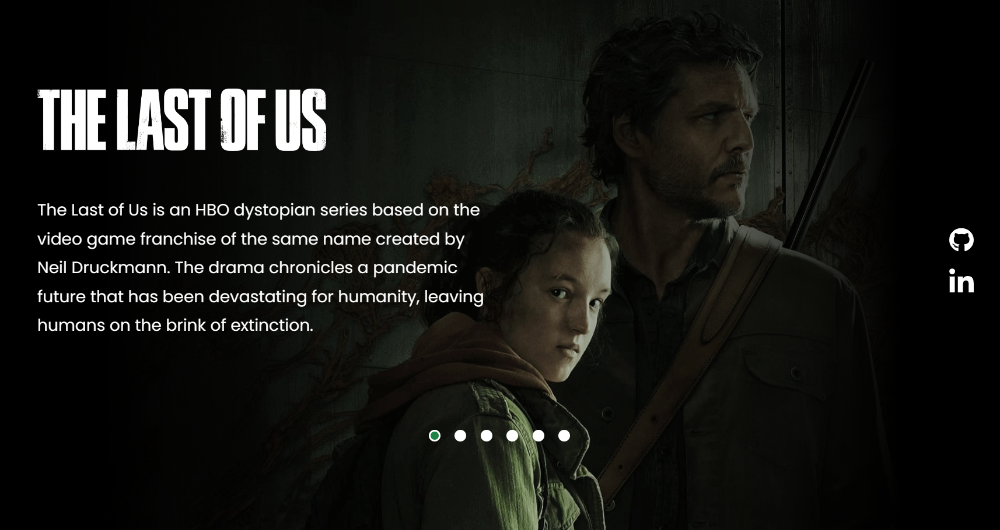

<h1 align="center"> The Last of Us | Landing Page </h1>

Participação de evento gratuito, promovido por Dev em Dobro.  

  <a href="#-tecnologias">Tecnologias</a>&nbsp;&nbsp;&nbsp;|&nbsp;&nbsp;&nbsp;
  <a href="#-projeto">Projeto</a>&nbsp;&nbsp;&nbsp;|&nbsp;&nbsp;&nbsp;
  <a href="#-layout">Layout</a>&nbsp;&nbsp;&nbsp;|&nbsp;&nbsp;&nbsp;
  <a href="#memo-licença">Licença</a>

  

 

  

## 🚀 Tecnologias

Esse projeto foi desenvolvido com as seguintes tecnologias:

- HTML e CSS
- JavaScript
- Git e Github

## 💻 Projeto

Landing Page para exposição da série The Last of Us.

- [Acesse o projeto finalizado, online](https://otavio095.github.io/Projeto_DevLnks/)

---

Feito Por Otávio Fernandes, através da plataforma Dev em Dobro :wave: [Participe da guilda Dev em Dobro!](https://discord.gg/ZETAmRUg)
